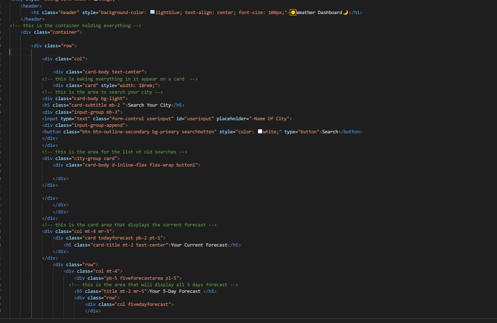
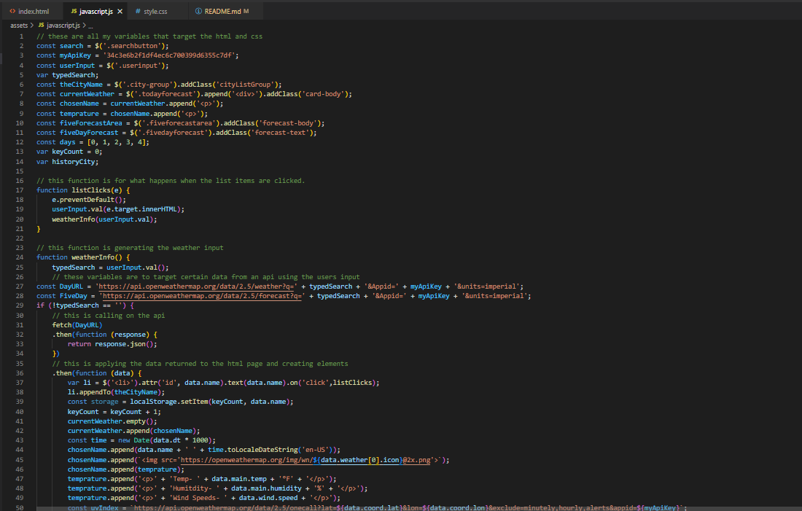

# weather-dashboard

## Description 

This page is a weather dashboard. This page will check the weather of any known city and return the days forecast inclouding the next 5 days. When the cuurent weather is shown you will be given the temprature, an image for the weather, the humitdity, the wind speeds, and the uv index. The uv index is color coded for its respectful number, anything 2 or less will appear green, anything from 3-7 will appear yellow, and anything 8 and above will appear purple. When the 5 days are displayed the image will show as will the date, the temprature will show and the humidity. When clicking on a previous search it will reload/research the city that was clicked.

[Deployable-Link](https://sufyaanvaidya.github.io/weather-dashboard/)

## Installation

1. I created a repository to store and added my unedited files.
2. With the starter files added i began adding my html base.
3. Next i added bootstrap, jquery, moment.js, and javascript css files.
4. Now i began to style the page via html using bootstrap and added classes to css.
5. when the page was styled i began editing the js file.
6. Using jquery i targeted elements in my html page.
7. Next i created functions for the list clicks and loading the weather.
8. In those functions i used fetch to retrieve the data from an api.
9. After i created a function for the 5 day forecast and color coded the background.
10. Once all the other functions were created i needed one that creates every search as a new li element.
11. If the list item is clicked i made it so the city or list item clicked will bring up its weather.

## Usage 

## Credits

- Sufyaan Vaidya (https://github.com/SufyaanVaidya)
- (https://openweathermap.org/current)
- (https://api.jquery.com/)
- (https://momentjs.com/docs/#/get-set/)
- (https://openweathermap.org/forecast5)
- (https://openweathermap.org/api/one-call-3)

## Technology Used

- HTML
- CSS
- Javascript
- jquery
- Bootstrap
- OpenWeatherAPI

## License

- [This-website-has-an-MIT-license](https://github.com/SufyaanVaidya/weather-dashboard/blob/4ca419a1e289b2c6337069a71cdcc536db577407/LICENSE)